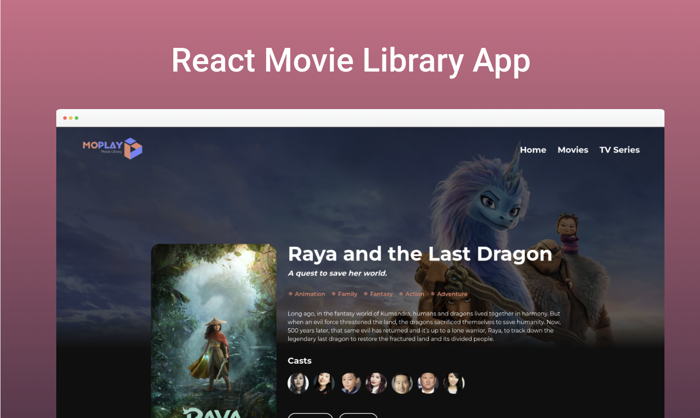

# React Movie TMDB Api



### [Demo app](https://react-movie-tmdb-wam.netlify.app/)

A Movie Library made with ReactJS using The Movie Database API

These instructions will get you a copy of the project up and running on your local machine for development and testing purposes. See deployment for notes on how to deploy the project on a live system.

### Requirements

Clone this repository

```
git clone https://github.com/wachidadmirul/react-movie-tmdb.git
```

You need to create an API KEY in [The Movie Database API](https://www.themoviedb.org/documentation/api) and put your API key on **_src/api/apiConfig.js_**

```
apiKey: 'yourapikeyhere'
```

### Installing

Clone the Repository and run

```
npm install
npm start
```

### Deployment

To deploy simply run

```
npm run build
```

## Built With

- [React JS](https://reactjs.org/)
- [Axios](https://axios-http.com/)
- [Swiper](https://swiperjs.com/react)
- [React Router](https://github.com/ReactTraining/react-router)
- [Sass](https://sass-lang.com/)
- [TMDB](https://www.themoviedb.org/)

## Contributing

Please feel free to send pull request if you want to contribute!

## Author

- [Wachid Amirul M](https://github.com/wachidamirul/)
